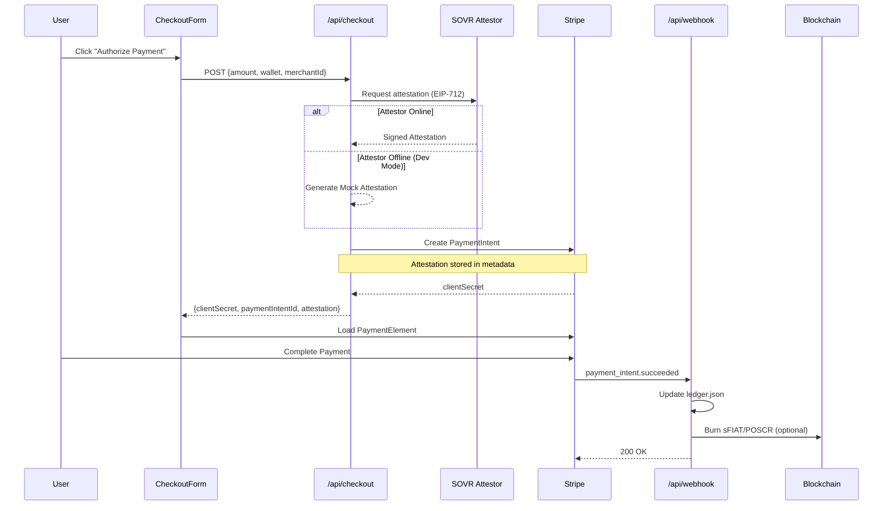

# USD Gateway Workflow Overview

## The Attested Payments Flow (Stripe Pull Model)

This document describes the end-to-end checkout workflow for SOVR → USD settlement using cryptographically signed attestations.

---

## Flow Diagram



---

## Step-by-Step Breakdown

### 1. Initiation
- User clicks **"Authorize Payment"** in the `CheckoutForm` component
- Frontend collects: `amount`, `wallet` (EVM address), `merchantId`

### 2. Attestation Request
**Endpoint**: `POST /api/checkout`

The Gateway calls the **SOVR Attestor Service** to validate the transaction:
- Validates wallet, amount, merchant parameters
- Returns an **EIP-712 signed attestation**
- Contains: `signature`, `signer`, `expiry`, `nonce`

**Fallback**: In dev/demo mode, if the Attestor is unreachable, a mock attestation is generated locally.

### 3. PaymentIntent Creation
The Gateway creates a Stripe `PaymentIntent` with:
- The USD amount
- **Crucial**: Attestation data attached to `metadata`

This **links the fiat payment to the on-chain credit system**.

```typescript
const paymentIntent = await stripe.paymentIntents.create({
  amount: amountInCents,
  currency: 'usd',
  metadata: {
    wallet: request.wallet,
    merchantId: request.merchantId,
    attestation_signature: attestation.signature,
    attestation_signer: attestation.signer,
    attestation_expiry: attestation.expiry
  }
});
```

### 4. Frontend Completion
- Frontend receives `clientSecret`
- Loads Stripe's `PaymentElement`
- User enters card details and confirms

### 5. Webhook Settlement
**Endpoint**: `POST /api/webhook`

When Stripe fires `payment_intent.succeeded`:

1. **Ledger Update**: Write transaction to `ledger.json`
2. **On-Chain Action** (optional):
   - Burn `sFIAT` tokens (settlement complete)
   - Or burn `POSCR` (point-of-sale credit redemption)

---

## API Reference

### Request: `POST /api/checkout`
```json
{
  "amount": 10.00,
  "wallet": "0x1234...abcd",
  "merchantId": "merchant-001",
  "orderId": "order-abc",
  "burnPOSCR": true
}
```

### Response
```json
{
  "clientSecret": "pi_xxx_secret_xxx",
  "paymentIntentId": "pi_xxx",
  "attestation": {
    "signature": "0xabc...",
    "signer": "0xdef..."
  }
}
```

---

## Environment Variables

| Variable | Purpose |
|----------|---------|
| `STRIPE_SECRET_KEY` | Backend Stripe key (sk_...) |
| `NEXT_PUBLIC_STRIPE_PUBLISHABLE_KEY` | Frontend Stripe key (pk_...) |
| `STRIPE_WEBHOOK_SECRET` | Validates webhook signatures |
| `ATTESTOR_SERVICE_URL` | SOVR Attestor endpoint |
| `RPC_URL` | Blockchain RPC for burns |
| `PRIVATE_KEY` | **Dev only**: Admin key for burn calls |

---

## Connection to LegacyCompliantBank

The **USD Gateway** (this system) integrates with the **LegacyCompliantBank** smart contract:

| Gateway Action | Contract Function |
|----------------|-------------------|
| Successful payment | `transferToFedCreditUnion()` |
| Bulk merchant payouts | `bulkTransferFunds()` |
| Credit redemption | `burn()` |

The webhook can trigger contract calls to:
1. Distribute tokens to beneficiaries
2. Burn sFIAT to balance the ledger
3. Update the `fedCreditUnionAddress` for compliance
